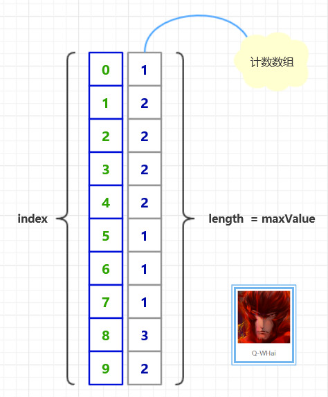
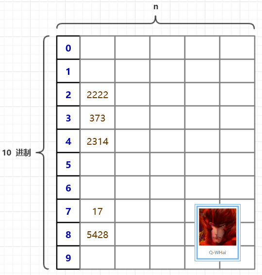
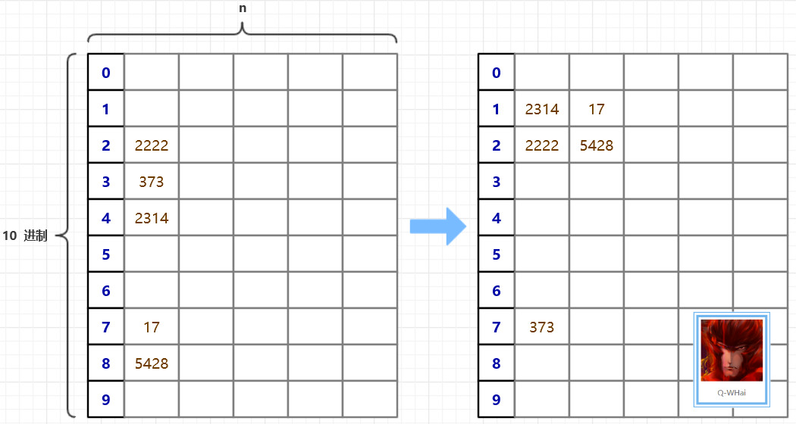
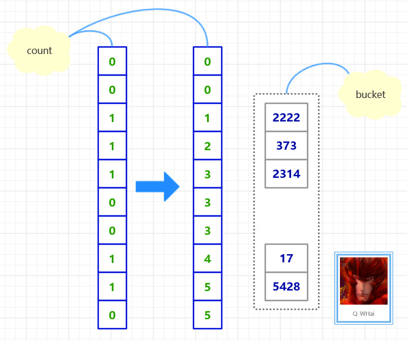
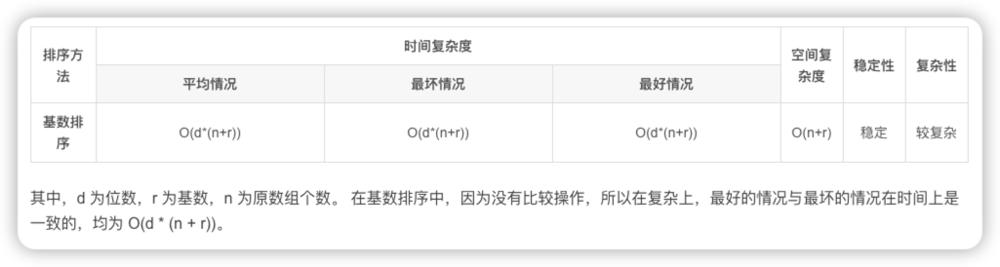

### 核心思想

构建一个足够大的数组 hashArray[]，数组大小需要保证能够把所有元素都包含在这个数组上 。
假设我们有无序序列 T = [ 2314, 5428, 373, 2222, 17 ]
首先初始化数组 hashArray[] 为一个全零数组。当然，在 Java 里，这一步就不需要了，因为默认就是零了。
在对序列 T 进行排序时，只要依次读取序列 T 中的元素，并修改数组 hashArray[] 中把元素值对应位置上的值即可。这一句有一些绕口。打个比方，我们要把
T[0] 映射到 hashArray[] 中，就是 hashArray[T[0]] = 1. 也就是 hashArray[2314] = 1. 如果序列 T 中有两个相同元素，那么在
hashArray 的相应位置上的值就是 2。
下图是计数排序的原理图：
（假设有无序序列：[ 5, 8, 9, 1, 4, 2, 9, 3, 7, 1, 8, 6, 2, 3, 4, 0, 8 ]）



上面的计数排序只是一个引导，好让你可以循序渐进地了解基数排序。



上面这幅图，或许你已经在其他的博客里见到过。这是一个很好的引导跟说明。在基数排序里，我们需要一个很大的二维数组，二维数组的大小是
（10 * n）。10 代表的是我们每个元素的每一位都有 10 种可能，也就是 10 进制数。在上图中，我们是以每个数的个位来代表这个数，于是，5428
就被填充到了第 8 个桶中了。下次再进行填充的时候，就是以十位进行填充，比如 5428 在此时，就会选择以 2 来代表它。



### 算法优化

在算法的原理中，我们是以一张二维数组的表来存储这些无序的元素。使用二维数组有一个很明显的不足就是二维数组太过稀疏。数组的利用率为
10%。
在寻求优化的路上，我们想到一种可以压缩空间的方法，且时间复杂度并没有偏离得太厉害。那就是设计了两个辅助数组，一个是 count[]
，一个是 bucket[]。count 用于记录在某个桶中的最后一个元素的下标，然后再把原数组中的元素计算一下它应该属于哪个“桶”，并修改相应位置的
count 值。直到最大数的最高位也被添加到桶中，或者说，当所有的元素都被被在第 0 个桶中，基数排序就结束了。
优化后的原理图如下：



``` java
import org.algorithm.array.sort.interf.Sortable;

/**
 * <p>
 * 基数排序/桶排序
 * </p>
 * 2016年1月19日
 * 
 * @author <a href="http://weibo.com/u/5131020927">Q-WHai</a>
 * @see <a href="http://blog.csdn.net/lemon_tree12138">http://blog.csdn.net/lemon_tree12138</a>
 * @version 0.1.1
 */
public class RadixSort implements Sortable {
    
    @Override
    public int[] sort(int[] array) {
        if (array == null) {
            return null;
        }
        
        int maxLength = maxLength(array);
        
        return sortCore(array, 0, maxLength);
    }

    private int[] sortCore(int[] array, int digit, int maxLength) {
        if (digit >= maxLength) {
            return array;
        }
        
        final int radix = 10; // 基数
        int arrayLength = array.length;
        int[] count = new int[radix];
        int[] bucket = new int[arrayLength];
        
        // 统计将数组中的数字分配到桶中后，各个桶中的数字个数
        for (int i = 0; i < arrayLength; i++) {
            count[getDigit(array[i], digit)]++;
        }
        
        // 将各个桶中的数字个数，转化成各个桶中最后一个数字的下标索引
        for (int i = 1; i < radix; i++) {
            count[i] = count[i] + count[i - 1];
        }
        
        // 将原数组中的数字分配给辅助数组 bucket
        for (int i = arrayLength - 1; i >= 0; i--) {
            int number = array[i];
            int d = getDigit(number, digit);
            bucket[count[d] - 1] = number;
            count[d]--;
        }
        
        return sortCore(bucket, digit + 1, maxLength);
    }
    
    /*
     * 一个数组中最大数字的位数
     * 
     * @param array
     * @return
     */
    private int maxLength(int[] array) {
        int maxLength = 0;
        int arrayLength = array.length;
        for (int i = 0; i < arrayLength; i++) {
            int currentLength = length(array[i]);
            if (maxLength < currentLength) {
                maxLength = currentLength;
            }
        }
        
        return maxLength;
    }
    
    /*
     * 计算一个数字共有多少位
     * 
     * @param number
     * @return
     */
    private int length(int number) {
        return String.valueOf(number).length();
    }
    
    /*
     * 获取 x 这个数的 d 位数上的数字
     * 比如获取 123 的 0 位数,结果返回 3
     * 
     * @param x
     * @param d
     * @return
     */
    private int getDigit(int x, int d) {
        int a[] = { 1, 10, 100, 1000, 10000, 100000, 1000000, 10000000, 100000000, 1000000000 };
        return ((x / a[d]) % 10);
    }
}

```

### 复杂度分析

