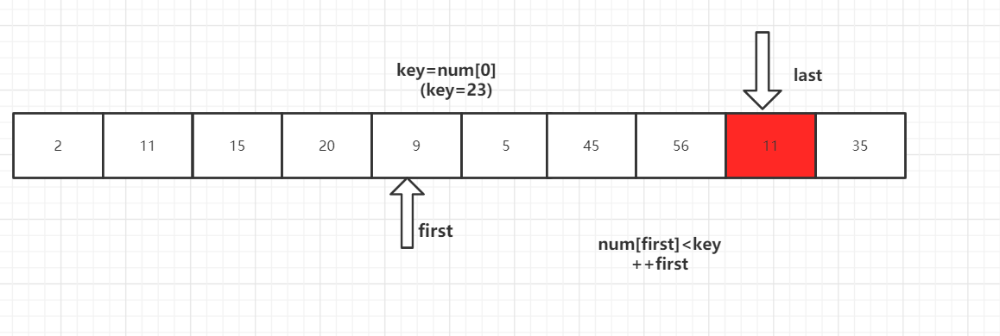

#### 一、简介

快速排序是（Quick sort）是对冒泡排序的一种改进，是非常重要且应用比较广泛的一种高效率排序算法。

#### 二、算法思路

快速排序是通过多次比较和交换来实现排序，在一趟排序中把将要排序的数据分成两个独立的部分，对这两部分进行排序使得其中一部分所有数据比另一部分都要小，
然后继续递归排序这两部分，最终实现所有数据有序。

大致步骤如下：

1. 首先设置一个分界值也就是基准值又是也称为监视哨，通过该分界值将数据分割成两部分。
2. 将大于或等于分界值的数据集中到右边，小于分界值的数据集中到左边。一趟排序过后，左边部分中各个数据元素都小于分界值，而右边部分中各数据元素都大于或等于分界值，且右边部分个数据元素皆大于左边所有数据元素。
3. 然后，左边和右边的数据可以看成两组不同的部分，重复上述1和2步骤 当左右两部分都有序时，整个数据就完成了排序。

#### 三、算法步骤图解

首先设置三个参数，first指向区间左端，last指向区间右端，key为当前的分界值。
从待排序的数据元素中选取一个通常为第一个作为基准值元素（key）key=num[0]，设置双指针first指向区间左端，last指向区间右端。


一、

key 首先与 num[last] 进行比较，如果 num[last]<key，则num[first]=num[last]将这个比key小的数放到左边去，如果num[last]>=key则-
-last，再拿num[last]与key进行比较，直到num[last]<key交换元素为止。


二、
num[last]<key交换元素后，转向左边部分，用num[first]与key进行比较，如果num[first]<
key,则++first，然后继续进行比较，直至num[first]>key,则将num[last]=num[first]。


三、
重复上述一二步骤





四、
第一趟排序结束，得到[2,11,15,20,9,5] 23 [56,45,35] 然后对左右子数列进行同样的操作。
2 [11,15,20,9,5] 23 [35,45] 56
2 [5,9] 11 [20,15] 23 35 45 56
2 5 9 11 15 20 23 35 45 56
完成从小到大的排序

四、算法性能分析

* 最好情况

每次数据元素都能平均的分成两个部分。得到一个完全二叉树。如果有n个数据元素，那么数的深度为
时间复杂度为O(nlogn)

* 最坏情况

在最坏的情况下，这个数仅有右子树或左子树，比较次数为 （n-1）+（n-2) + (n-3) + … +1=n*(n-1)/2 ,因此时间复杂度为O(n^2)
,在待排序数据元素已经有序的情况下快速排序时间复杂度最高

空间复杂度为O(n）
快速排序是一种不稳定的排序算法，会改变数据元素的相对位置，也是内排序中平均效率最高的排序算法。

五、算法实现

``` java
public static int[] quick_sort(int[] num, int l, int r){
//r为数组元素总个数，last下标等于r-1
        int first=l,last=r-1,key=num[first];
        while(first<last){
            while(first<last&&num[last]>=key){
                --last;
            }
            //如果值小于 key分界值 交换
            num[first]=num[last];
            while(first<last&&num[first]<key){
                ++first;
            }
            //如果值大于key分界值 交换
            num[last]=num[first];
        }
        num[first]=key;
        //递归左右部分进行快排
         if (first>l) {
             num=quick_sort(num, l, first);
         }
        if (first+1<r){
            num=quick_sort(num,first+1,r);
        }
        return num;
    }

```