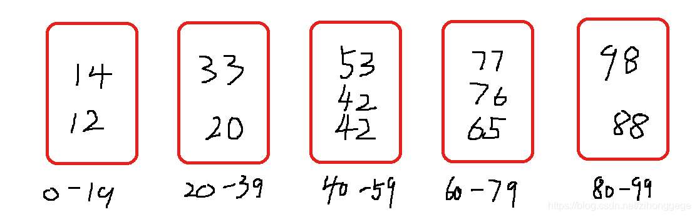

### 核心思想

桶排序顾名思义，是将数据放在几个有序的桶内，将每个桶内的数据进行排序，最后有序地将每个桶中的数据从小到大依次取出，即完成了排序。
我们举个例子来帮助理解，现在有一个数组：20，33，42，12，65，42，98，76，14，88，53，77。运用桶排序，假设我们划分5个桶，分别装0-19，20-39，40-59，60-79，80-99的数，再将每个桶中的数进行排序，可以运用快排，最后再将一个一个桶里的数依次取出，即完成排序。



### 代码实现

``` java
public class Main {
    @Test
    public void test() {
        int[] a = {20, 33, 42, 12, 65, 42, 98, 76, 14, 88, 53, 77};
        bucketSort(a, a.length);
        for (int i = 0; i < a.length; i++) {
            System.out.println(a[i]);
        }
    }
 
    public void bucketSort(int[] a, int n) {
        //模拟上面给的例子将a = {20, 33, 42, 12, 65, 42, 98, 76, 14, 88, 53, 77}放在5个桶里
        //新建桶集合
        List<ArrayList<Integer>> buckets = new ArrayList<>();
        //对每个桶进行初始化
        for (int i = 0; i < 5; i++) {
            buckets.add(new ArrayList<Integer>());
        }
        //将数据放在对应的桶里
        for (int i = 0; i < n; i++) {
            buckets.get(a[i]/20).add(a[i]);
        }
        for (int i = 0; i < 5; i++) {
            //模拟单个桶排序过程，这里用Collections的sort方法进行排序
            Collections.sort(buckets.get(i));
        }
        //将桶内数据依次放进数组中
        int k = 0;
        for (int i = 0; i < 5; i++) {
            for (int j = 0;; j++) {
                if(j == buckets.get(i).size()){
                    break;
                }
                a[k++] = buckets.get(i).get(j);
            }
        }
    }
}
```

### 性能分析

经过上面的分析，你应该懂得了桶排序的思想。不过你可能会有一个疑问：每个桶内再用其他的排序算法进行排序（比如快排）,这样子时间复杂度不还是O(
nlogn)吗？请看下面这段分析。
如果要排序的数据有n个，我们把它们分在m个桶中，这样每个桶里的数据就是k = n / m。每个桶内排序的时间复杂度就为O(k*logk)。m个桶就是m
* O(k * logk)=m * O((n / m)*log(n / m))=O(nlog(n / m))
。当桶的个数m接近数据个数n时，log（n/m）就是一个较小的常数，所以时间复杂度接近O(n)。

### 应用场景

看了上面的分析，既然桶排序时间复杂度为线性，是不是就能替代例如快排、归并这种时间复杂度为O(nlogn)的排序算法呢？
答案是否定的，桶排序的应用场景十分严苛，首先，数据应该分布比较均匀。讲一种较坏的情况，如果数据全部都被分到一个桶里，那么桶排序的时间复杂度是不是就退化到O(
nlogn)了呢？其次，要排序的数据应该很容易分成m个桶，每个桶也应该有大小顺序。