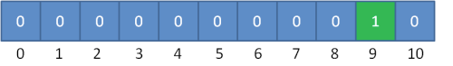
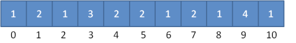

### 概述

计数排序是一个非基于比较的排序算法，元素从未排序状态变为已排序状态的过程，是由额外空间的辅助和元素本身的值决定的。该算法于1954年由
Harold H. Seward 提出。它的优势在于在对一定范围内的整数排序时，它的复杂度为Ο(n+k)
（其中k是整数的范围），快于任何比较排序算法。当然这是一种牺牲空间换取时间的做法，而且当
的时候其效率反而不如基于比较的排序，因为基于比较的排序的时间复杂度在理论上的下限是 。

### 算法思路

计数排序对输入的数据有附加的限制条件：

1、输入的线性表的元素属于有限偏序集 S；

2、设输入的线性表的长度为 n，|S|=k（表示集合 S 中元素的总数目为 k），则 k=O(n)。

在这两个条件下，计数排序的复杂性为O(n)。

计数排序的基本思想是对于给定的输入序列中的每一个元素 x，确定该序列中值小于 x
的元素的个数（此处并非比较各元素的大小，而是通过对元素值的计数和计数值的累加来确定）。一旦有了这个信息，就可以将 x
直接存放到最终的输出序列的正确位置上。例如，如果输入序列中只有 17 个元素的值小于 x 的值，则 x 可以直接存放在输出序列的第 18
个位置上。当然，如果有多个元素具有相同的值时，我们不能将这些元素放在输出序列的同一个位置上，因此，上述方案还要作适当的修改。

### 算法过程

1. 根据待排序集合中最大元素和最小元素的差值范围，申请额外空间；
2. 遍历待排序集合，将每一个元素出现的次数记录到元素值对应的额外空间内；
3. 对额外空间内数据进行计算，得出每一个元素的正确位置；
4. 将待排序集合每一个元素移动到计算得出的正确位置上。

### 详解算法

先假设 20 个数列为：{9, 3, 5, 4, 9, 1, 2, 7, 8，1，3, 6, 5, 3, 4, 0, 10, 9, 7, 9}。
让我们先遍历这个无序的随机数组，找出最大值为 10 和最小值为 0。这样我们对应的计数范围将是 0 ~
10。然后每一个整数按照其值对号入座，对应数组下标的元素进行加1操作。
比如第一个整数是 9，那么数组下标为 9 的元素加 1，如下图所示。


第二个整数是 3，那么数组下标为 3 的元素加 1，如下图所示。
继续遍历数列并修改数组......。最终，数列遍历完毕时，数组的状态如下图。

数组中的每一个值，代表了数列中对应整数的出现次数。
有了这个统计结果，排序就很简单了，直接遍历数组，输出数组元素的下标值，元素的值是几，就输出几次。比如统计结果中的 1 为 2，就是数列中有
2 个 1 的意思。这样我们就得到最终排序好的结果。
0, 1, 1, 2, 3, 3, 3, 4, 4, 5, 5, 6, 7, 7, 8, 9, 9, 9, 9, 10

### 代码实现

``` java
public class CountingSort implements IArraySort {
    @Override
    public int[] sort(int[] sourceArray) throws Exception {
        // 对 arr 进行拷贝，不改变参数内容
        int[] arr = Arrays.copyOf(sourceArray, sourceArray.length);
 
        int maxValue = getMaxValue(arr);
 
        return countingSort(arr, maxValue);
    }
 
    private int[] countingSort(int[] arr, int maxValue) {
        int bucketLen = maxValue + 1;
        int[] bucket = new int[bucketLen];
 
        for (int value : arr) {
            bucket[value]++;
        }
 
        int sortedIndex = 0;
        for (int j = 0; j < bucketLen; j++) {
            while (bucket[j] > 0) {
                arr[sortedIndex++] = j;
                bucket[j]--;
            }
        }
        return arr;
    }
 
    private int getMaxValue(int[] arr) {
        int maxValue = arr[0];
        for (int value : arr) {
            if (maxValue < value) {
                maxValue = value;
            }
        }
        return maxValue;
    }
}
```

### 总结

算法性能
时间复杂度
O(n+k)。

空间复杂度
O(k)。

稳定性
稳定。

特别说明
虽然计数排序看上去很强大，但是它存在两大局限性：
1.当数列最大最小值差距过大时，并不适用于计数排序
比如给定 20 个随机整数，范围在 0 到 1 亿之间，此时如果使用计数排序的话，就需要创建长度为 1 亿的数组，不但严重浪费了空间，而且时间复杂度也随之升高。
2.当数列元素不是整数时，并不适用于计数排序
如果数列中的元素都是小数，比如 3.1415，或是 0.00000001 这样子，则无法创建对应的统计数组，这样显然无法进行计数排序。
正是由于这两大局限性，才使得计数排序不像快速排序、归并排序那样被人们广泛适用。

